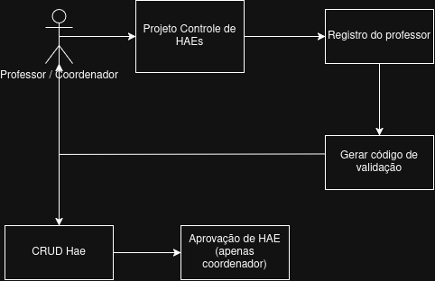

# Sistema de Controle de HAEs - Fatec Zona Leste

Este sistema, desenvolvido por alunos da **Fatec da Zona Leste**, tem como finalidade digitalizar e otimizar o processo de gestão das **HAEs (Horas de Atividades Específicas)**. A plataforma visa simplificar a solicitação, avaliação, acompanhamento e emissão de certificados, tornando o processo mais ágil e transparente para alunos, professores e coordenadores.

---

## 🚀 Funcionalidades Principais

O sistema foi projetado com diferentes níveis de acesso para cada tipo de usuário:

### Para Professores:
-   **Cadastro e Login:** Autenticação segura com verificação por e-mail institucional.
-   **Esqueci Minha Senha:** Fluxo completo para recuperação de acesso.
-   **Criação e Edição de HAEs:** Um formulário multi-etapas para detalhar as atividades.
-   **Visualização de Solicitações:** Um dashboard para acompanhar o status das HAEs submetidas.

### Para Coordenadores:
-   **Atribuição de Role Automática:** E-mails `@cps.sp.gov.br` recebem a permissão de Coordenador no registro.
-   **Dashboard de Curso:** Visualização de todas as HAEs pertencentes ao seu curso de coordenação.
-   **Gerenciamento de Status:** Aprovação, reprovação e marcação de HAEs como completas.

### Para Diretores e Administradores:
-   **Dashboard Geral:** Gráficos e métricas com uma visão de alto nível de todas as HAEs do sistema (por status, por curso, etc.).
-   **Visualização Completa:** Acesso a listas detalhadas de todos os professores e todas as HAEs.
-   **Gerenciamento de Usuários (Admin):** Interface para alterar as permissões (roles) dos usuários do sistema.

---

## 🛠️ Tecnologias Utilizadas

O projeto foi construído com uma stack moderna e robusta, separando claramente as responsabilidades entre o frontend e o backend.

### Frontend (Aplicação Cliente)
-   **React.js:** Biblioteca JavaScript para a construção de interfaces de usuário reativas e componentizadas.
-   **Vite:** Ferramenta de build de última geração que oferece um desenvolvimento extremamente rápido.
-   **TypeScript:** Superset do JavaScript que adiciona tipagem estática para um código mais seguro e manutenível.
-   **Tailwind CSS:** Framework CSS "utility-first" para a criação de designs customizados de forma ágil.
-   **Material UI (MUI):** Biblioteca de componentes React para uma UI consistente e alinhada ao Material Design.

### Backend (Servidor e API)
-   **Java 21:** Versão LTS (Long-Term Support) da linguagem Java, garantindo robustez e performance.
-   **Spring Boot:** Framework para a criação de aplicações Java standalone e de nível de produção com configuração mínima.
-   **JPA (Jakarta Persistence API) & Hibernate:** Padrão para mapeamento objeto-relacional (ORM), facilitando a comunicação com o banco de dados.

### Banco de Dados
-   **PostgreSQL:** Sistema de gerenciamento de banco de dados relacional de código aberto, conhecido por sua confiabilidade e extensibilidade.

### Hospedagem e DevOps
-   **Render:** Plataforma de nuvem unificada para hospedar todos os componentes da aplicação:
    -   **Frontend:** Implantado como um *Static Site*.
    -   **Backend:** Implantado como um *Web Service*.
    -   **Banco de Dados:** Instância de PostgreSQL gerenciada pela Render.
-   **Swagger (SpringDoc):** Geração automática de documentação interativa para a API, facilitando testes e integração.
-   **Git & GitHub:** Sistema de controle de versão distribuído para o gerenciamento do código-fonte e colaboração.

---

## 👨‍💻 Desenvolvedores

-   [@endrigogustavo](https://github.com/endrigogustavo)
-   [@gustavoventieri](https://github.com/gustavoventieri)
-   [@nickolss](https://www.github.com/nickolss)
-   [@VNav4rr0](https://github.com/VNav4rr0)

## 🎓 Orientadores

-   [@jefersonrl](https://github.com/jefersonrl)
-   [@MrSpock182](https://github.com/MrSpock182)

---

## Observações Finais

Este projeto representa um passo importante na modernização dos processos acadêmicos da Fatec Zona Leste, promovendo agilidade, transparência e organização na gestão das atividades extracurriculares dos alunos.